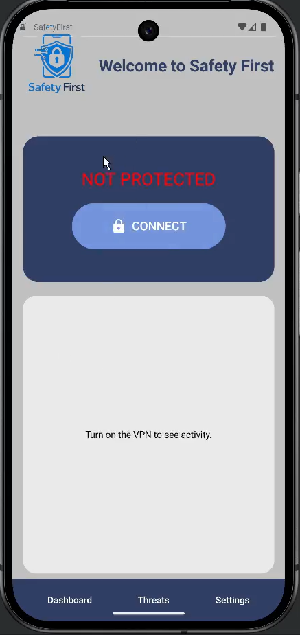
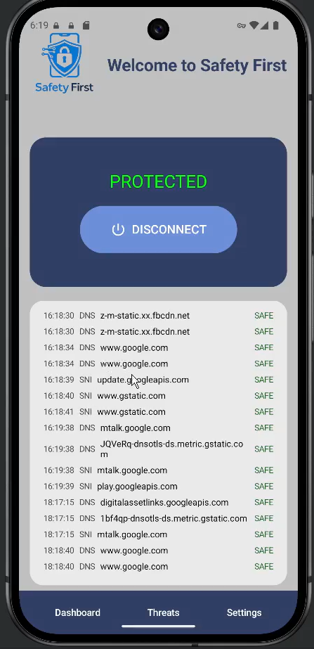
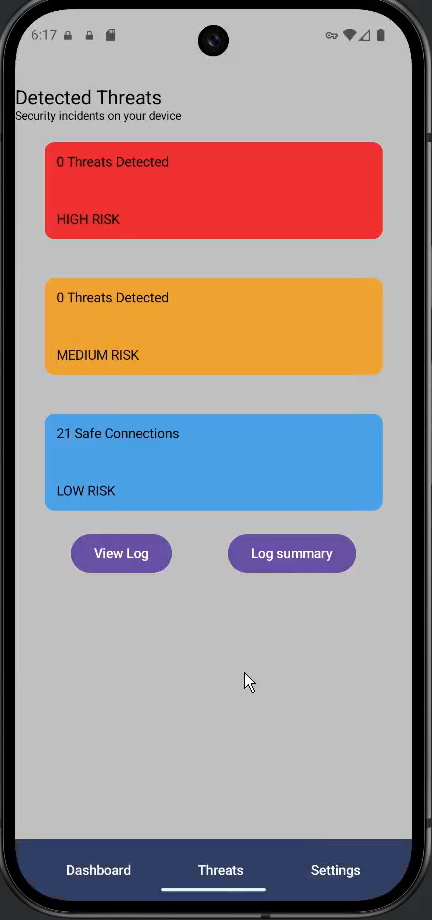
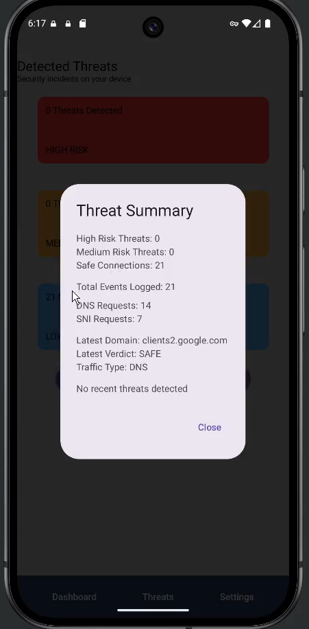
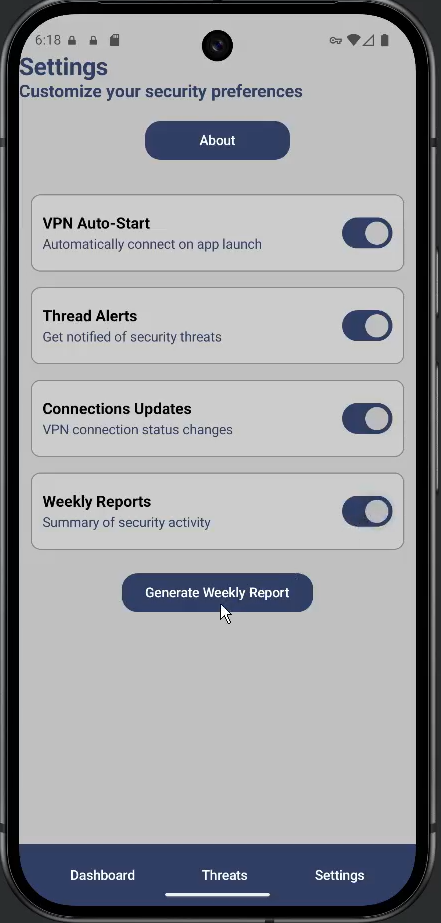
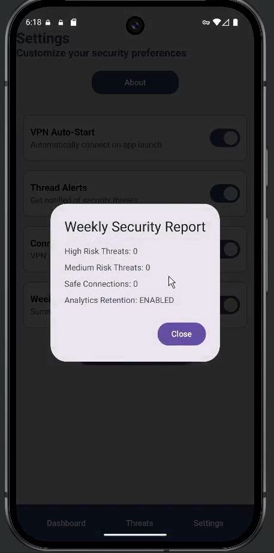

# Safety First Mobile Threat Blocker:
Senior Capstone Project | Mobile Cybersecurity Application
The Safety First Mobile Threat Blocker is a cybersecurity-focused mobile application designed to prevent users from accessing known malicious websites. The application leverages threat intelligence feeds to identify domains associated with phishing, malware distribution, and other cyber threats before a connection is established.
This project was developed as a collaborative university capstone project with the help of Brian Mendoza, Alejandro Alvarez, Tony Ywakim, 
Alexander Esqueda, Angel Ramirez, Eli Stafford and Melissa Agredano. 

## Problem Statement:
Mobile users are frequently exposed to phishing websites, malware-hosting domains, and other malicious online content. Traditional browser protections may not always identify emerging threats in real time.
Safety First was developed to provide proactive protection by leveraging threat intelligence feeds to identify and block known malicious domains before users establish a connection.

## Features:
- Real-time malicious domain detection
- Threat intelligence feed integration
- Website blocking capabilities
- User-friendly mobile interface
- Security event logging
- Configurable protection settings

## Technologies Used:
- Android Studio
- Java
- GitHub
- VPN Service Framework
- DNS Monitoring
- SNI Analysis
- Threat Intelligence Feeds

## Security Considerations:
The application was designed to address:
- Phishing attacks
- Malware delivery websites
- Known malicious domains
- Unsafe browsing destinations

## Limitations:
- Cannot detect previously unknown malicious domains
- Depends on the quality and freshness of threat intelligence feeds
- Does not inspect encrypted content

## Security Capabilities:
The application successfully:
- Monitors DNS and SNI traffic
- Evaluates domains against threat intelligence feeds
- Categorizes threats by severity level
- Generates real-time threat alerts
- Logs security events for user review
- Produces weekly security summaries
- Provides VPN connection health monitoring

## My Contributions:
Served as a project co-lead and cybersecurity-focused developer throughout the project lifecycle.
### Security Feature Development
Personally implemented:
- Live threat alert generation
- Threat severity classification
- Threat Summary dashboard
- Security event logging interface
- Weekly security reporting system
- VPN connection status notifications
- User-controlled analytics preferences

Documentation & Project Management:
- Authored the Software Quality Assurance Plan (SQAP)
- Authored the Software Quality Management Plan (SQMP)
- Authored the Software Requirements Specification (SRS)
- Authored Maintenance Manual Version 1
- Authored Maintenance Manual Version 2
- Developed project presentation materials
- Coordinated team collaboration and milestone tracking
- Helped align engineering efforts with project deadlines

## Key Security Features:
- Live Threat Alerts: Users receive real-time notifications when potentially malicious domains are detected. 
- Threat Classification: Security events are categorized into High, Medium, and Low risk levels to improve user awareness.
- Security Event Logging: The application maintains a log of analyzed DNS and SNI requests, allowing users to review network activity.
- Weekly Security Reports: Users may opt into analytics collection and receive periodic summaries of detected activity and overall security posture.
- VPN Health Monitoring: The application provides status updates regarding VPN connectivity and backend communication health.

## Screenshots: 
### Safety First Disabled (Dashboard)

### Safety First Enabled (Dashboard)

### Detected Threats Screen 

### Daily Threats Summary 

### Settings Screen

### Weekly Security Report

